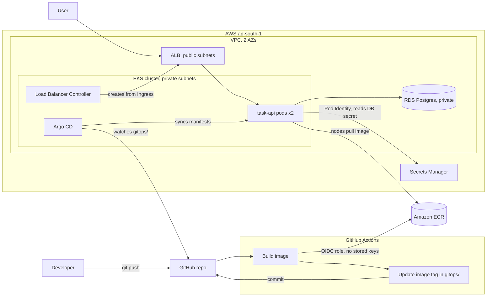

# Architecture

```mermaid
flowchart LR
  dev["Developer"] -->|git push| gh["GitHub repo"]

  subgraph CI["GitHub Actions"]
    build["Build image"] --> tag["Update image tag in gitops/"]
  end

  gh --> build
  tag -->|commit| gh
  build -->|OIDC role, no stored keys| ecr[("Amazon ECR")]

  subgraph AWS["AWS ap-south-1"]
    subgraph VPC["VPC, 2 AZs"]
      alb["ALB, public subnets"]
      subgraph EKS["EKS cluster, private subnets"]
        lbc["Load Balancer Controller"]
        argo["Argo CD"]
        pods["task-api pods x2"]
      end
      rds[("RDS Postgres, private")]
    end
    sm["Secrets Manager"]
  end

  user["User"] --> alb --> pods
  lbc -->|creates from Ingress| alb
  argo -->|watches gitops/| gh
  argo -->|syncs manifests| pods
  pods -->|nodes pull image| ecr
  pods -->|Pod Identity, reads DB secret| sm
  pods --> rds
```