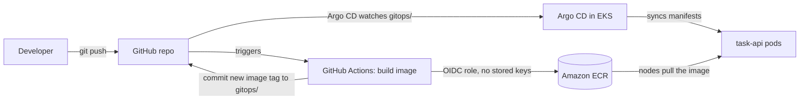
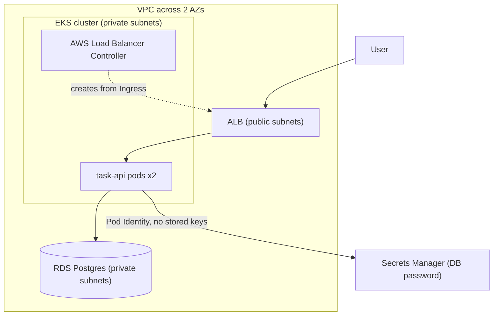

# Architecture

## 1. Delivery flow (from `git push` to a running update)

```mermaid
flowchart LR
  dev["Developer"] -->|git push| gh["GitHub repo"]
  gh -->|triggers| build["GitHub Actions: build image"]
  build -->|OIDC role, no stored keys| ecr[("Amazon ECR")]
  build -->|commit new image tag to gitops/| gh
  gh -->|Argo CD watches gitops/| argo["Argo CD in EKS"]
  argo -->|syncs manifests| pods["task-api pods"]
  ecr -->|nodes pull the image| pods
```

## 2. Runtime (how a request is served)

```mermaid
flowchart TB
  user["User"] --> alb["ALB (public subnets)"]

  subgraph VPC["VPC across 2 AZs"]
    alb
    subgraph EKS["EKS cluster (private subnets)"]
      pods["task-api pods x2"]
      lbc["AWS Load Balancer Controller"]
    end
    rds[("RDS Postgres (private subnets)")]
  end

  alb --> pods
  lbc -. creates from Ingress .-> alb
  pods --> rds
  pods -->|Pod Identity, no stored keys| sm["Secrets Manager (DB password)"]
```